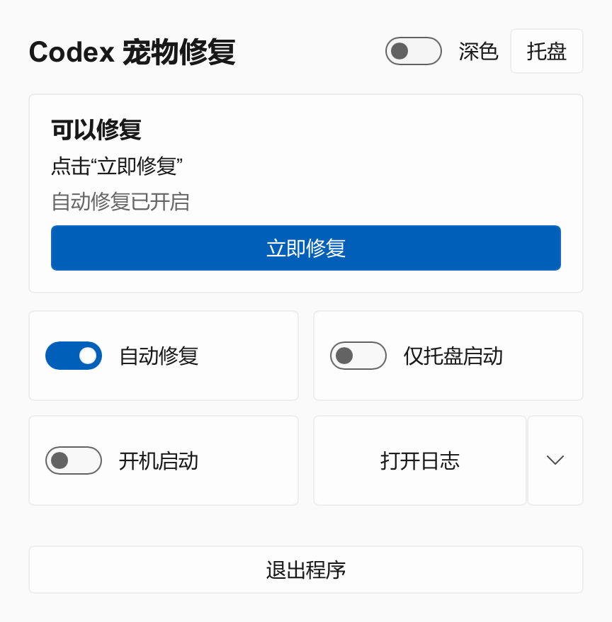
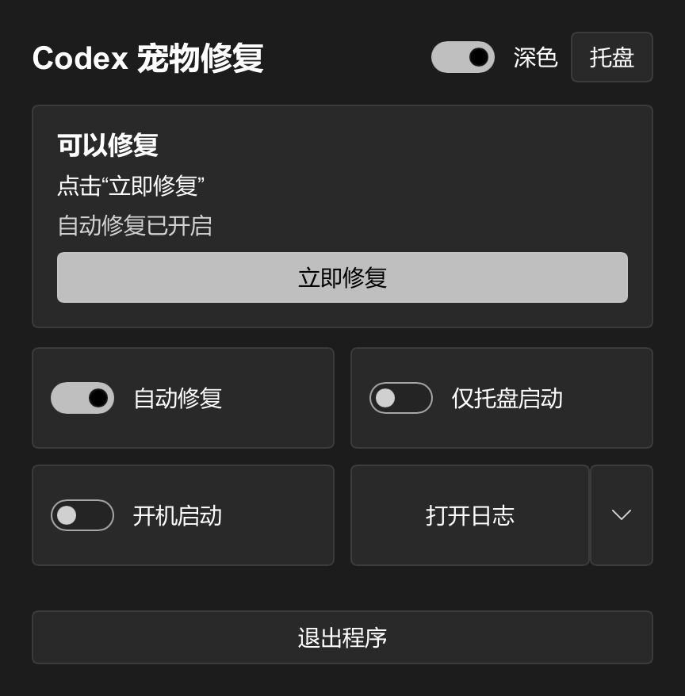

# Codex 宠物修复

宠物还在桌面上，却怎么也拖不动？点一下，试着恢复它。

**[⬇ 下载 1.1.0](https://github.com/BaoZiFly-233/codex-pet-repair/releases/latest)**　·　[开始使用](#三步开始)　·　[反馈问题](https://github.com/BaoZiFly-233/codex-pet-repair/issues)

Windows 64 位 · 解压即用 · 完整解压约 11 MB

---

## 界面展示

以下为 1.1.0 的应用内渲染预览；默认窗口会随状态内容调整高度，手动缩小后可滚动查看。

<table>
<tr><th align="center">浅色</th><th align="center">深色</th></tr>
<tr>
<td width="50%"></td>
<td width="50%"></td>
</tr>
</table>

## 三步开始

**1 · 下载并解压** 
在下载页选择 `PetRepair-v1.1.0-windows-x64.zip`，完整解压到一个方便找到的文件夹。

**2 · 打开工具和宠物** 
运行 `PetRepair.exe`，打开 Codex，让宠物出现在桌面上。请先关闭其他宠物修复工具，并尽量只保留一个宠物浮窗。

**3 · 点一下，再试着拖动** 
点击「立即修复」，等待约 3 秒后试着拖动宠物。如出现效果确认，选择「可以拖动」或「仍然不行」。

## 按你的习惯使用

<table>
<tr><th width="150" align="left">想做什么</th><th align="left">可以这样做</th></tr>
<tr><td><strong>需要时修一下</strong></td><td>点击「立即修复」，过程中也可以取消。</td></tr>
<tr><td><strong>少操一点心</strong></td><td>确认当前 Codex 版本有效后，开启「自动修复」。宠物重新出现时，工具会自动尝试。</td></tr>
<tr><td><strong>让 V2 宠物看向鼠标</strong></td><td>开启「看向鼠标」，按卡片提示以跟随模式启动 Codex。移动宠物附近的鼠标，视线由 Codex 自己绘制。</td></tr>
<tr><td><strong>让界面收起来</strong></td><td>点击「托盘」或关闭窗口；双击托盘图标可重新打开。开启「仅托盘启动」后，下次也会直接收起来。</td></tr>
<tr><td><strong>登录时启动</strong></td><td>开启「开机启动」，工具会在登录 Windows 后留在托盘中。</td></tr>
<tr><td><strong>换个明暗风格</strong></td><td>右上角的「深色」开关可以直接切换，并记住你的选择。</td></tr>
<tr><td><strong>查看运行记录</strong></td><td>点击「打开日志」；旁边的小箭头还能复制诊断摘要、打开日志文件夹。</td></tr>
</table>

自动修复、开机启动和看向鼠标默认关闭，开关分别保存；Codex 更新后，需要重新确认拖动修复效果。

1.1.0 的改动见 [更新记录](CHANGELOG.md)，构建与验证说明见 [开发说明](DEVELOPMENT.md)和[验证记录](REFACTOR-VALIDATION.md)。

## 常见问题

<strong>“看向鼠标”怎么开启？</strong>

开启「看向鼠标」。如提示需要跟随模式，先从 Codex 菜单完全退出 Codex，再在修复工具中点击「以跟随模式启动 Codex」，然后显示一个 V2 宠物。

跟随模式使用仅本机可访问的调试端口 `127.0.0.1:19227`。其他本机程序也可能通过该端口控制 Codex 页面；不要将端口转发到网络。关闭「看向鼠标」会停止视线输入；若自动修复仍开启，会保留只读的输入检查。完全退出 Codex 才会关闭调试端口，之后正常启动即可恢复普通模式。

目前识别 1536 × 2288、8 列 11 行的 V2 素材。视线使用宠物浮窗收到的真实鼠标移动；光标离开浮窗或停下后恢复待机。直接悬停在宠物上、按住鼠标、拖动、电脑操作光标活动或安全桌面切换时让原生交互优先。旧素材、多个浮窗、无法确认身份或接口变化时会暂停并显示原因，不会强行连接。

窗口尺寸变化后会清理旧坐标，下一次鼠标移动按新位置计算，不会仅因尺寸变化重复修复。有本机连接时，自动守护会核对鼠标所在的实体交互区域和 Windows 实际接收输入的窗口；连续确认异常后才安排重试，仍遵守稳定时间、修复间隔和次数限制。鼠标静止在其他位置、透明边角、窗口被遮挡或连接断开，都不会直接判作故障。

修复前先确认跟随已暂停，完成后恢复接收新的鼠标移动；两个开关仍分别保存。关闭「看向鼠标」后，自动守护可以继续只读检查输入，不会驱动视线。没有本机连接时，保留已确认版本的首次自动修复与手动修复，不会根据尺寸变化反复重置。

素材尺寸符合 V2，并不代表其中的方向画对了。最后两行需要按 Codex 的约定绘制 16 个方向；如果只有一侧看反、角色被切开或变化不明显，可以先换另一只 V2 宠物对照。工具传入鼠标坐标，具体外观取决于素材中的方向帧。

<strong>关闭窗口后，工具还在运行吗？</strong>

是的，关闭窗口只会收起界面，已经开启的自动修复会继续工作。想完全关闭，请点击「退出程序」，或使用托盘菜单里的「退出」。

<strong>为什么有时需要等待，或者修复没有效果？</strong>

连续修复之间会留一点间隔，原因会显示在界面上。宠物和语音等浮窗有时很相似，发现多个时工具会先等待，请先关闭其他浮窗再试。

修复不会修改 Codex 的安装文件，效果可能随 Codex 更新而变化。

<strong>设置放在哪里？怎么更新或卸载？</strong>

设置和日志保存在程序旁边的 `data` 文件夹。

更新时先选择「退出程序」，再把新版解压到原文件夹并替换文件，保留 `data` 就能沿用设置。

移动文件夹后，请重新关闭、开启一次「开机启动」。不再使用时，先关闭「开机启动」，退出程序，再删除文件夹即可。

<strong>日志怎么看？会自动上传吗？</strong>

日志会用电脑默认的文本查看程序打开，不会自动上传。工具不会读取你的聊天内容、账号或密钥。

## 遇到问题，告诉我们

在「打开日志」旁边点小箭头，选择「复制诊断摘要」，然后 [新建一条问题反馈](https://github.com/BaoZiFly-233/codex-pet-repair/issues)。写清楚原本想做什么、实际发生了什么、是否每次都会出现；界面显示异常时，截图也很有帮助。

发送前先看一眼摘要和截图，去掉不想公开的内容。

## 感谢与开源

修复线索来自 [Codex #41513](https://github.com/openai/codex/issues/41513)，恢复方法参考了 [ChatGPT-Overlay-Fix](https://github.com/FoegiUpdate/ChatGPT-Overlay-Fix)，早期探索也借鉴了 [Codex Tweaks](https://github.com/codex-tweaks/codex-tweaks)。界面由 [Slint](https://github.com/slint-ui/slint) 提供，采用 Fluent 风格。

完整的组件、借鉴和图标来源见 **[致谢与许可说明](CREDITS.md)**。本项目自己的代码使用 [MIT 许可](LICENSE)，第三方组件和宠物形象的权利仍归各自权利人所有。

友情链接：[LINUX DO](https://linux.do)。

---

非 OpenAI 官方产品，与 OpenAI 没有隶属或授权关系。

